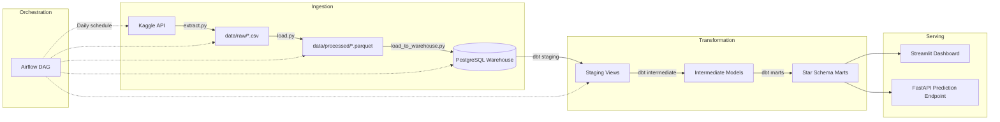
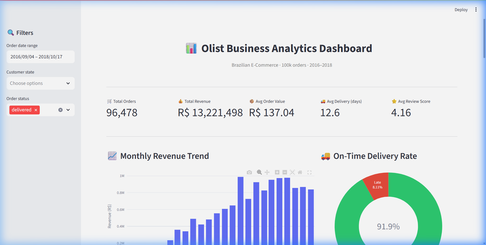
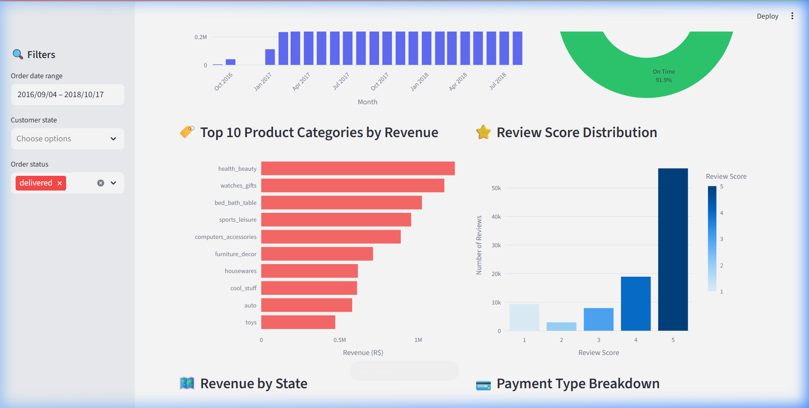
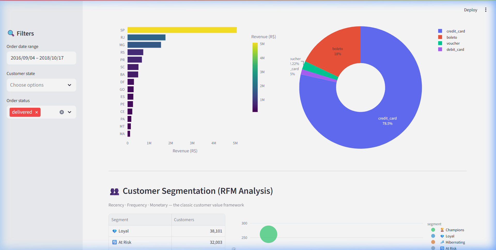
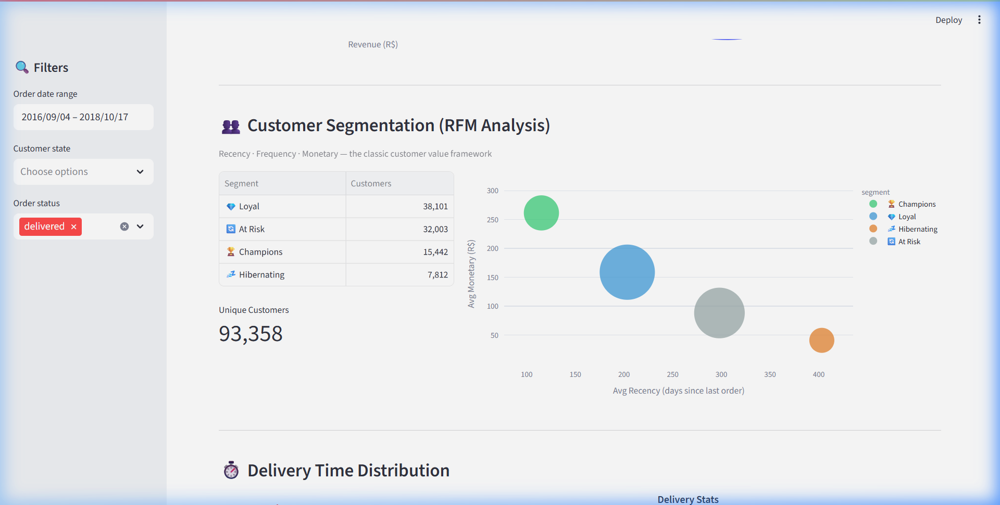

# Olist E-Commerce Analytics Pipeline & Dashboard

An end-to-end data platform built on the [Olist Brazilian E-Commerce Dataset](https://www.kaggle.com/datasets/olistbr/brazilian-ecommerce) (100k+ real orders from 2016 to 2018).

[](https://business-analytics-pipeline-p2fgx8kxmtfhgrv8apprnxm.streamlit.app/)
[](https://python.org)
[](https://getdbt.com)
[](https://airflow.apache.org)
[](https://docs.docker.com/compose/)
[](LICENSE)

---

## Overview

This repository implements an ELT data architecture covering data ingestion, validation, warehouse transformations, orchestration, and business intelligence.

- **Data Ingestion**: Kaggle API download, schema validation, and Parquet columnar conversion.
- **Data Warehouse**: PostgreSQL 16.
- **Transformation (dbt)**: 3-layer architecture (staging, intermediate, marts) implementing a dimensional Star Schema (`fact_orders` + 4 dimension tables) with unit and schema quality tests.
- **Orchestration**: Apache Airflow DAG managing pipeline execution steps.
- **Analytics & BI**: Streamlit dashboard featuring operational KPIs, revenue trends, delivery logistics, and RFM customer segmentation.
- **Containerization**: Multi-container stack configured via Docker Compose.

---

## Architecture



### Dimensional Model (Star Schema)


---

## Dashboard Screenshots

| View | Screenshot |
|---|---|
| **Executive KPIs & Trends** |  |
| **Product Categories & Reviews** |  |
| **Geographic Distribution & Payments** |  |
| **RFM Segmentation & Delivery Detail** |  |

---

## Repository Structure

```text
├── ingestion/                  # Python extraction, schema validation & warehouse loading
│   ├── extract.py              #   Kaggle dataset downloader
│   ├── load.py                 #   Schema validator & CSV-to-Parquet converter
│   ├── load_to_warehouse.py    #   Parquet to PostgreSQL loader
│   └── schemas.py              #   Data contract definitions per raw dataset
├── dbt/                        # dbt transformation project
│   ├── models/
│   │   ├── staging/            #   8 models: field renaming & type casting
│   │   ├── intermediate/       #   3 models: aggregations & deduplication
│   │   └── marts/              #   5 models: fact_orders & 4 dimension tables
│   ├── dbt_project.yml
│   └── profiles.yml            #   dbt connection profile
├── orchestration/dags/
│   └── pipeline_dag.py         #   Airflow pipeline DAG definition
├── dashboard/
│   ├── app.py                  #   Streamlit application with RFM segmentation
│   └── Dockerfile
├── api/
│   ├── main.py                 #   FastAPI prediction service
│   └── Dockerfile
├── scripts/
│   └── init-multiple-dbs.sh    #   PostgreSQL database initialization script
├── docker-compose.yml          #   Services orchestration (Postgres, Airflow, Dashboard, API)
└── README.md
```

---

## Quickstart

### Prerequisites

- Python 3.11+
- Docker & Docker Compose
- Kaggle API token (`kaggle.json`)

### Local Setup

```bash
# 1. Clone repository
git clone https://github.com/benmoustafa/business-analytics-pipeline.git
cd business-analytics-pipeline

# 2. Install dependencies
pip install -r requirements.txt

# 3. Extract and validate raw data
python ingestion/extract.py
python ingestion/load.py

# 4. Run dashboard locally
pip install -r dashboard/requirements.txt
streamlit run dashboard/app.py
```

### Docker Setup

To launch the complete infrastructure (PostgreSQL, Airflow, Streamlit, FastAPI):

```bash
docker compose up -d
```

Service endpoints:
- **Streamlit Dashboard**: `http://localhost:8501`
- **Airflow Webserver**: `http://localhost:8080` (credentials: `admin` / `admin`)
- **FastAPI Documentation**: `http://localhost:8000/docs`
- **PostgreSQL Database**: `localhost:5432`

---

## Technical Highlights

- **Schema Validation & Error Handling**: Ingestion scripts enforce data contracts (`schemas.py`), logging null counts and flagging duplicate primary keys before converting CSVs to columnar Parquet format.
- **dbt Testing & Documentation**: Data models include test suites (`unique`, `not_null`, `relationships`, `accepted_values`) in `schema.yml` to maintain data integrity across layers.
- **RFM Customer Segmentation**: Uses Recency, Frequency, and Monetary scoring algorithms on customer order histories to segment customers into actionable tiers.
- **Production CI/CD**: Automated GitHub Actions workflow for Python linting and code validation.

---

## Author

**Benabdelhadi Moustafa**
- GitHub: [@benmoustafa](https://github.com/benmoustafa)
- LinkedIn: [Benabdelhadi Moustafa](https://www.linkedin.com/in/moustafa-benabdelhadi-780448320)

---

## License

Distributed under the MIT License. See [LICENSE](LICENSE) for details.
