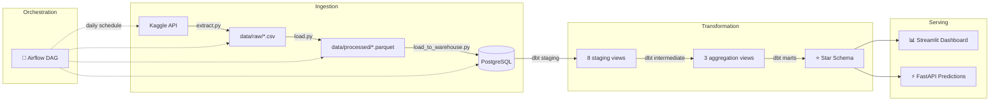
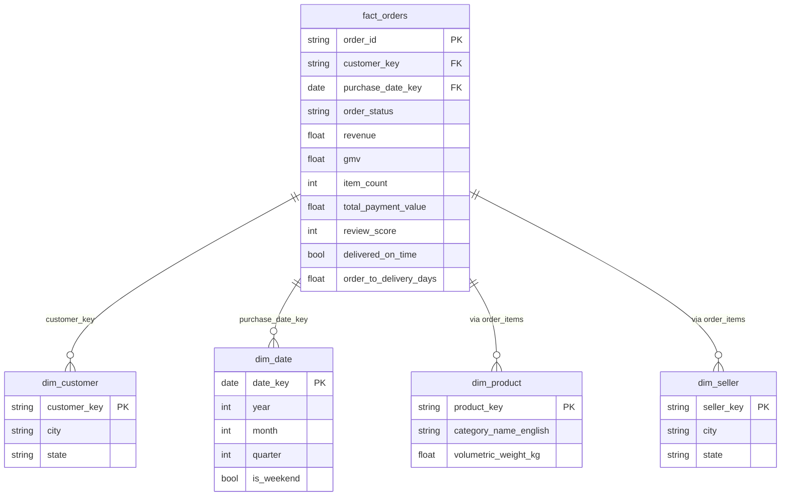

<div align="center">

# 📊 Business Analytics & Demand Forecasting Pipeline

**End-to-end data platform** on the [Olist Brazilian E-Commerce dataset](https://www.kaggle.com/datasets/olistbr/brazilian-ecommerce) — from raw Kaggle CSVs to a live interactive dashboard.

[](https://python.org)
[](https://getdbt.com)
[](https://airflow.apache.org)
[](https://streamlit.io)
[](https://docs.docker.com/compose/)
[](LICENSE)

</div>

---

## 🖼️ Dashboard Preview

<div align="center">


*Top-level KPIs (96k orders, R$13.2M revenue, 91.9% on-time delivery) with monthly revenue trend*


*Top product categories by revenue · Review score distribution (1–5 stars)*


*Revenue by Brazilian state · Payment method breakdown (78.5% credit card)*


*RFM customer segmentation (93k customers) · Delivery time distribution (median 10.2 days)*

</div>

---

## 🏗️ Architecture



### Star Schema



---

## 📁 Project Structure

```
├── ingestion/                  # Python ingestion scripts
│   ├── extract.py              #   Kaggle download + interactive auth setup
│   ├── load.py                 #   Schema validation + CSV → Parquet
│   ├── load_to_warehouse.py    #   Parquet → PostgreSQL tables
│   └── schemas.py              #   Expected column definitions per CSV
├── dbt/                        # SQL transformation layer
│   ├── models/
│   │   ├── staging/            #   8 models — clean, rename, cast types
│   │   ├── intermediate/       #   3 models — aggregations + dedup
│   │   └── marts/              #   5 models — star schema (fact + dims)
│   ├── dbt_project.yml
│   └── profiles.yml            #   Docker-ready connection profile
├── orchestration/dags/
│   └── pipeline_dag.py         #   Airflow: extract → validate → warehouse → dbt
├── dashboard/
│   ├── app.py                  #   Streamlit KPI dashboard + RFM segmentation
│   └── Dockerfile
├── api/
│   ├── main.py                 #   FastAPI prediction endpoint
│   └── Dockerfile
├── modeling/                   #   Notebooks: RFM + demand forecasting (WIP)
├── scripts/
│   └── init-multiple-dbs.sh    #   Postgres init: creates warehouse + airflow DBs
├── docs/images/                #   Dashboard screenshots
├── docker-compose.yml          #   Full stack: Postgres, Airflow, Streamlit, FastAPI
└── README.md
```

---

## 🚀 Quickstart

### Prerequisites

- Python 3.11+
- Docker & Docker Compose (for the full stack)
- Kaggle account ([get API key](https://www.kaggle.com/settings))

### Option 1: Run locally (fastest)

```bash
# Clone the repo
git clone https://github.com/moustafabenabdelhadi/business-analytics-pipeline.git
cd business-analytics-pipeline

# Install dependencies
pip install -r requirements.txt

# Download data from Kaggle (will prompt for credentials on first run)
python ingestion/extract.py

# Validate schemas & convert to Parquet
python ingestion/load.py

# Launch the dashboard
pip install -r dashboard/requirements.txt
streamlit run dashboard/app.py
# → Open http://localhost:8501
```

### Option 2: Full Docker stack

```bash
docker compose up -d
```

| Service | URL | Credentials |
|---|---|---|
| 📊 Dashboard | http://localhost:8501 | — |
| 🔄 Airflow UI | http://localhost:8080 | admin / admin |
| ⚡ API docs | http://localhost:8000/docs | — |
| 🐘 PostgreSQL | localhost:5432 | postgres / postgres |

---

## 📊 Key Metrics (from the dashboard)

| KPI | Value |
|---|---|
| Total Orders | 96,478 |
| Total Revenue | R$ 13,221,498 |
| Avg Order Value | R$ 137.04 |
| On-Time Delivery Rate | 91.9% |
| Avg Delivery Time | 12.6 days (median 10.2) |
| Avg Review Score | 4.16 / 5.0 |
| Unique Customers | 93,358 |
| Payment: Credit Card | 78.5% |

---

## 🛠️ Tech Stack

| Layer | Tool | Why |
|---|---|---|
| **Ingestion** | Python (pandas, pyarrow) | Schema-validated, type-safe loading |
| **Warehouse** | PostgreSQL 16 | Industry standard, free, Docker-ready |
| **Transformation** | dbt-core + dbt-postgres | Industry standard ELT, testable, documented |
| **Orchestration** | Apache Airflow 2.9 | DAG-based scheduling with UI + retries |
| **Dashboard** | Streamlit + Plotly | Interactive, fast to build, free hosting |
| **API** | FastAPI | Async, auto-docs, production-ready |
| **Containerization** | Docker Compose | One command to run the full stack |

---

## ✅ Status

- [x] **Ingestion** — Kaggle download + schema validation + Parquet conversion
- [x] **Warehouse loading** — Parquet → PostgreSQL tables
- [x] **dbt staging** — 8 models covering all 9 source tables
- [x] **dbt intermediate** — 3 aggregation/dedup models
- [x] **dbt marts** — Full star schema (fact_orders + 4 dimensions)
- [x] **Orchestration** — Airflow DAG (5-step pipeline) + Docker Compose
- [x] **Dashboard** — Streamlit with KPIs, charts, RFM segmentation
- [ ] **Demand forecasting** — Prophet baseline + LSTM (in progress)
- [ ] **Model serving** — FastAPI wired to trained model
- [ ] **CI/CD** — GitHub Actions (lint + test)

---

## 🧠 What makes this project different

| This project | Typical Kaggle portfolio |
|---|---|
| End-to-end pipeline (ingestion → serving) | Single notebook |
| Schema validation + data quality checks | `pd.read_csv()` and hope for the best |
| dbt with tests (`unique`, `not_null`, `relationships`) | No data testing |
| Walk-forward backtesting (no data leakage) | Random train/test split |
| Docker Compose: clone and run in one command | "Works on my machine" |
| Star schema + dimension tables | Flat denormalized DataFrame |

---

## 👤 Author

**Moustafa Ben Abdelhadi**
- GitHub: [@moustafabenabdelhadi](https://github.com/moustafabenabdelhadi)
- LinkedIn: [moustafabenabdelhadi](https://linkedin.com/in/moustafabenabdelhadi)

---

## 📄 License

This project is licensed under the MIT License — see [LICENSE](LICENSE) for details.
